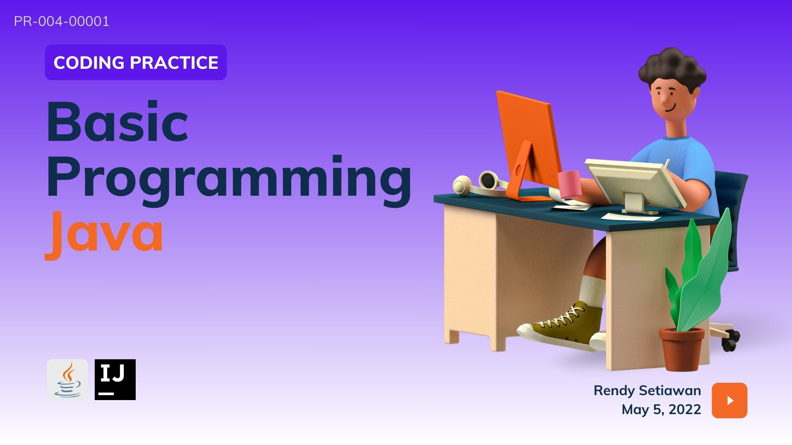

<kbd>
    
</kbd>

<p align="right">PR-004-00001</p>

# CODING PRACTICE - Basic Programming Java
This project create a simple Java program that demonstrates basic programming concepts in Java. The program will include:
- **Data Types** and **Variables** <!-- will use different types of variables in Java and how to declare and initialize them. -->
- **Arrays as Data Storage** <!-- in Java and how to use them. -->
- **Operator**
- **Input-Output Scheme**
- **Looping**
- **Branching**

---

<!-- ## Table of Content
1. [Tech Stack](#tech-stack)
2. [Task](#task)
3. [Documentation](#documentation)
 -->

<!-- ## Project Instruction
 -->

<!-- ## Project Goals
- -->

## Tech Stack
#### Programming Language
<!--[Java]-->
<p align="justify">
  <a href="https://www.java.com/">
    
  </a>
</p>    

#### Versioning Control
<!--[Git]-->
<p align="justify">    
  <a href="https://git-scm.com/">
    
  </a>
<!--[GitHub]-->
  <a href="https://github.com/">
    
  </a>    
</p>    

#### IDE
<!--[IntelliJ IDEA]-->
<p align="justify">      
  <a href="https://www.jetbrains.com/idea/">
    
  </a>
<p/>

#### Operating System
<!--[Fedora]-->
<p align="justify">
  <a href="https://getfedora.org/">
    
  </a>
</p>

<!-- ## Workflow
 -->

## Task
### 1. Menghitung Luas Segitiga
<p align="justify"> 
Andi menggambar sebuah segitiga yang alasnya berukuran **alas** cm dan tingginya berukuran **tinggi** cm. Ia ingin menghitung luas dari segitiga tersebut, bantulah Andi untuk menghitung luas segitiga!
</p>

**Input:**
``Alas = 20`` &nbsp; ``Tinggi = 25``

**Output:**
``250``

### 2. Konversi Nilai
<p align="justify"> 
Seorang Dosen sedangn memeriksa ujian mahasiswa dan akan memberikan nilai pada mahasiswa dengan A, B+, B, C, dan D. Kriteria penilaian dosen adalah sebagai berikut:
</p>
<table>
  <tr>
    <th>Nilai Number</th>
    <th>Nilai Huruf</th>
  </tr>
  <tr>
    <td>80 s/d 100</td>
    <td>A</td>
  </tr>
  <tr>
    <td>65 s/d 79</td>
    <td>B+</td>
  </tr>
  <tr>
    <td>50 s/d 64</td>
    <td>B</td>
  </tr>
  <tr>
    <td>35 s/d 49</td>
    <td>C</td>
  </tr>
  <tr>
    <td>0 s/d 34</td>
    <td>D</td>
  </tr>
</table>

**Apabila nilai < 0 dan > 100, maka nilainya "invalid". Tampilkan nilai konversi angka ke huruf!**

### 3. Faktor Bilangan
<p align="justify"> 
Faktor suatu bilangan yang habis membagi bilangan tersebut.
Tugas anda adalah untuk membuat sebuah program untuk mencetak faktor sebuah bilangan.
</p>

**Input:**
``6``

**Output:**
```
1
2
3
6
```

**Input:**
``20``

**Output:**
```
1
2
4
5
10
20
```

### 4. Faktor Bilangan II


### 5. Bilangan Prima
<p align="justify"> 
Dalam matematika, bilngan prima adalah bilangan asli yang lebih besar dari angka 1, yang faktor pembaginya adalah 1 dan bilangan itu sendiri. 2 dan 3 bilangan prima, 4 bukan bilangan prima karena 4 bisa dibagi 2. Kamu diminta untuk membuat fungsi untuk menentukan bahwa sebuah bilangan termasuk bilangan prima atau tidak.
</p>

**Input:**
``7``
&nbsp;
**Output:**
``True``

**Input:**
``10``
&nbsp;
**Output:**
``False``

### 6. Palindrome
<p align="justify"> 
Kata palindome adalah sebuah kata yang jika dibalik  tetap sama. Contoh, 'katak' dibalik tetap 'katak'. Buatlah sebuah program untuk mendeteksi sebuah string merupakan palindrome atau tidak?
</p>

**Input:**
``katak``
&nbsp;
**Output:**
``True``

**Input:**
``kupu-kupu``
&nbsp;
**Output:**
``False``

### 7. Exponentation
<p align="justify">

</p>

### 8. Play With Asterix
<p align="justify"> 

</p>

### 9. Draw XYZ
<p align="justify"> 
Buatlah sebuah function bernama drawXYZ yang menjalankan proses dengan menggunakan looping dan menerima satu parameter bernama height. Buatlah sebuah pola kemunculan simbol X, Y, dan Z di print, dimana Y mewakili kelipatan ganjil, Z kelipatan genap, dan X khusus kelipatan 3.
</p>

**Input:**
``5``

**Output:**
```
Y Z X Z Y
X Y Z X Z
Y X Y Z X
Z Y X Y Z
X Z Y X Y
```

### 10. Catak Tabel Perkalian
<p align="justify"> 

</p>

### 11. Ubah Huruf
<p align="justify"> 

</p>

### 12. Mean
<p align="justify"> 
Diberikan sebuah program yang menerima sebuah input array angka. Program akan menampilkan mean dari array angka tersebut.

**Mean** adalah angka rata-rata dari deret bilangan tersebut. Contoh, mean dari [1,2,3,4] 2.5. Kita perlu kemudian melakukan pembulatan angka dari hasil mean yang didapatkan
</p>

**Input:**
``[1,2,3,4]``
&nbsp;
**Output:**
``2.5``

## Documentation
#### To-Do
<!-- - [ ] Complete Workflow -->
- [ ] Complete Task
- [ ] Create Documentation Report

#### Report
- [Presentation]()
- [Documentation]()

---

[🔼 Back To Top](#coding-practice---basic-programming-java)